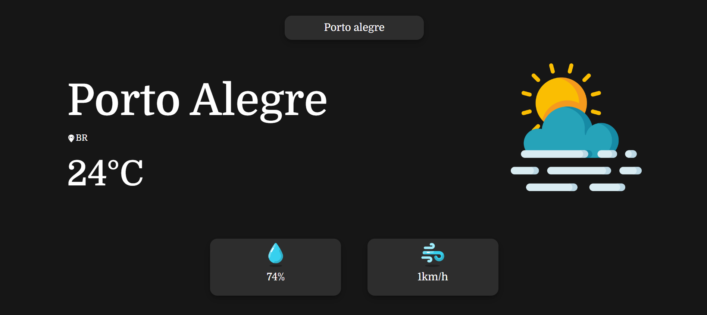
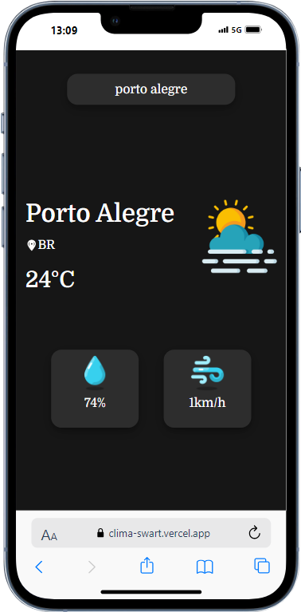

# Aplicativo de Clima
Projeto desenvolvido para colocar em prática noções de Hooks do React, ele aborda a previsão do tempo ao pesquisar uma cidade, mostrando: ícones personalizados, temperatura, vento e umidade em tempo real com a utilização da api OpenWeather.
 

## 🛠️ Construído com:
+ Api: OpenWeather
+ React.js
+ React Hooks: UseState e UseEffect
+ JavaScript
+ Bootstrap
+ HTML e CSS 